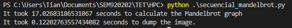
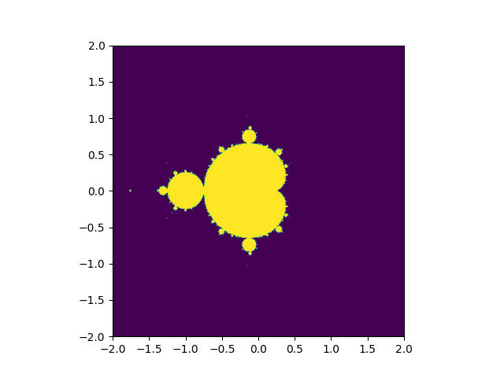

# parallelizeme
Proyecto 2 de Tópicos Especiales de Telemática. Solución paralelizada de un problema

## Integrantes
- Andrea Gonzales
- Sebastian Lara

## Problema

Elegimos el conjunto de Mandelbrot, el cual es un conjunto numérico dentro de los números complejos. Se trata de una ecuación que comienza a partir de un número C (que pertenece a los complejos) y se inicia una sucesión por recursión. Este problema está catalogado dentro de los “embarrassingly parallal”, es decir, puede ser perfectamente paralelizado computacionalmente. Para calcular el conjunto de mandelbrot, se utiliza zn+1=zn2+c el valor es obtenido por iteraciones, si diverge a infinito entonces el valor no pertenece al conjunto, de lo contrario sí pertenece. Mientras más iteraciones se hagan sobre un valor mejor será la aproximación para declararlo como parte del conjunto o no. Debido a esto entonces surgen algunas limitaciones en el cálculo del conjunto, primero es necesario tener buena capacidad de CPU y segundo, la precisión de punto flotante que tenga la arquitectura de la CPU. 

Este problema se puede resolver haciendo uso de hilos, cada hilo puede compartir el mismo espacio de memoria y además el cálculo de cada valor puede hacerse en paralelo con otros, esto indica que no hay dependencia entre cálculos.

## Resultados Iniciales

La siguiente imagen fue generada e escrita al escritorio en 17.14 segundos

### Diseño PCAM
* [pcam](pcam.md)
